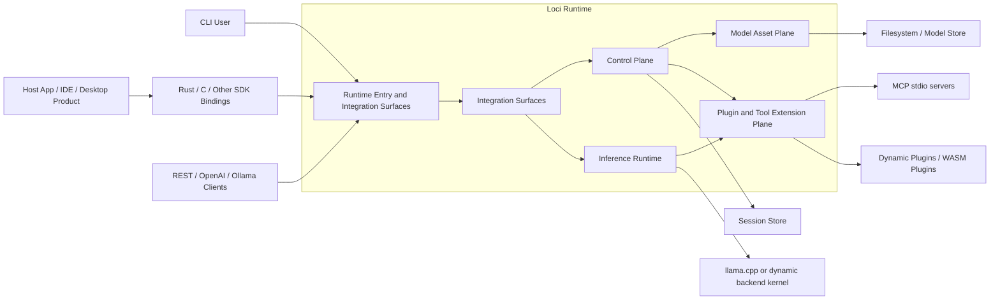
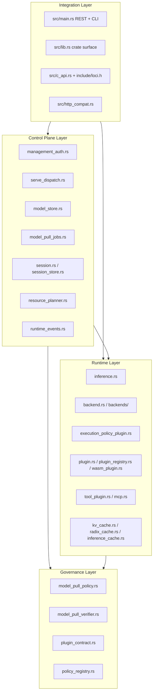
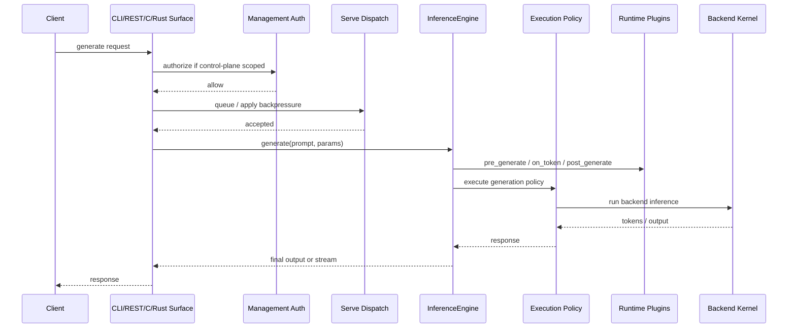
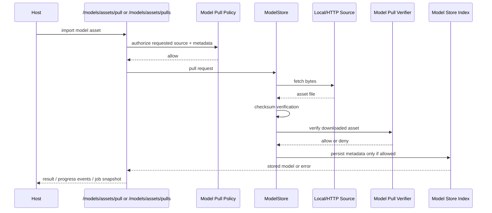
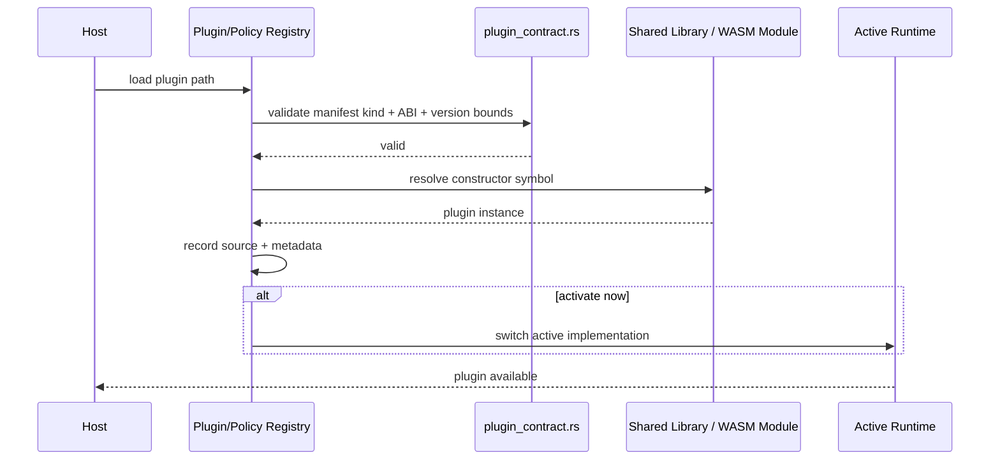

# Loci Architecture

Last updated: 2026-03-14

This document is the architecture-level description of Loci as it exists in this repository.

## 1. Positioning

Loci is an embeddable AI inference engine and control plane.

It is designed to be integrated into other software such as desktop apps, IDE copilots, local automation runtimes, service wrappers, and agent hosts. It is not positioned as a standalone end-user chat product.

The architectural thesis is:

- Keep the inference runtime embeddable.
- Keep the runtime upgradeable through plugins.
- Keep governance in the host's control.
- Keep compatibility APIs as adapters, not as the core.

## 2. Architecture Goals

- Multi-surface embedding: Rust crate, C ABI, REST.
- Plugin upgradeability: text plugins, tool plugins, policy plugins, backend kernels, image kernels.
- Local-first execution: run close to user-controlled storage and hardware.
- Host-owned governance: auth, dispatch, execution, model source admission, model trust verification.
- Operational clarity: runtime introspection, metrics, model inventory, session control.
- Extensible orchestration: tools, MCP, sessions, policy registries.

## 3. Non-Goals

- Shipping a polished consumer chat UI inside this repository.
- Coupling the engine to one assistant persona or one agent workflow.
- Making OpenAI/Ollama compatibility the core domain model.
- Forcing cloud-first orchestration for normal usage.

## 4. System Context

## 5. Layered Runtime View

## 6. Core Components and Responsibilities

| Component | Responsibility | Key modules |
|---|---|---|
| Integration surfaces | Expose Loci to hosts through Rust, C, CLI, and REST | `src/lib.rs`, `src/c_api.rs`, `src/main.rs` |
| Inference runtime | Build engines, run generation, manage streaming and execution policy | `src/inference.rs`, `src/backends/` |
| Plugin runtime | Load static, dynamic, and WASM plugins into the generation path | `src/plugin.rs`, `src/plugin_registry.rs`, `src/wasm_plugin.rs` |
| Tool execution plane | Register tools, load runtime tool plugins, bridge MCP servers | `src/tool_plugin.rs`, `src/mcp.rs`, `src/mcp_registry.rs` |
| Session plane | Persist and resume stateful model interactions | `src/session.rs`, `src/session_store.rs`, `src/session_bus.rs` |
| Model asset plane | Register external models, import managed assets, track inventory | `src/model_store.rs`, `src/model_pull_jobs.rs` |
| Governance plane | Apply dispatch, auth, execution, source-policy, and verifier controls | `src/serve_dispatch.rs`, `src/management_auth.rs`, `src/execution_policy_plugin.rs`, `src/model_pull_policy.rs`, `src/model_pull_verifier.rs` |
| Runtime event spine | Emit recent structured audit events and live streams for hosts | `src/runtime_events.rs`, `src/main.rs` |
| Compatibility adapters | Map Loci runtime semantics to OpenAI/Ollama-compatible HTTP contracts | `src/http_compat.rs`, `src/main.rs` |
| Resource planning | Estimate device placement and choose memory strategy hints | `src/resource_planner.rs`, `src/device.rs` |

## 7. Architectural Principles

### 7.1 Control Plane vs Data Plane

Loci separates control-plane concerns from the core inference path:

- Control plane: auth, dispatch, model inventory, session lifecycle, policy activation, plugin loading.
- Data plane: prompt execution, token streaming, embeddings, backend invocation.

This keeps host operations auditable and allows Loci to serve both embedded and service-mode deployments.

The runtime event bus reinforces this separation by emitting structured control-plane events without coupling hosts to one logging backend.

### 7.2 Compatibility Routes Are Adapters

OpenAI and Ollama routes are important for integration, but they are adapters over the same runtime. The architectural center remains the native Loci engine, tool registry, policy layer, and model governance.

### 7.3 Governance Is Layered

Model asset governance is intentionally split:

- Pre-fetch governance: model pull policy decides whether a source is allowed.
- Post-fetch governance: model pull verifier decides whether the downloaded bytes are trusted enough to persist.

This separation makes it possible to evolve from simple checksum rules to sidecar, signature, certificate, and provenance workflows without rewriting the store.

### 7.4 Plugins Extend the Runtime, Not Just the UI

Loci does not treat plugins as cosmetic hooks only. Plugins can extend:

- generation behavior
- tool execution
- dispatch behavior
- management auth
- execution policy
- model source policy
- model trust verification
- backend kernel loading
- image generation kernels

## 8. Key Runtime Flows

### 8.1 Generate Request Flow

### 8.2 Model Pull Governance Flow

### 8.3 Plugin Upgrade Flow

## 9. Architectural Strengths

- Clear separation between embedding surfaces and runtime internals.
- Multiple extension boundaries without forcing one plugin model for every use case.
- Governance hooks exist at several operational choke points.
- Model lifecycle has moved beyond raw file loading into inventory and policy management.
- Compatibility APIs do not fork a second engine implementation.
- The current structure can support higher-level projects such as `localhand` without turning Loci itself into assistant-specific UI code.

## 10. Current Gaps and Recommended Next Capabilities

These are the highest-value next features if Loci is to become a serious embeddable inference substrate.

### 10.1 Stable C-ABI Plugin Vtable

Current dynamic plugin families still rely on opaque Rust trait-object payloads. This is workable, but it is not the strongest long-term ABI story.

Recommended next step:

- define a C-stable plugin vtable ABI for the major plugin families
- keep the current opaque ABI as a transitional layer

### 10.2 Durable Event Sinks and Embedded Callbacks

Loci now has a unified runtime event spine exposed through `/events` and `/events/stream`, but the sink model is still in-process and memory-backed.

Recommended next step:

- add optional durable sinks such as rotating NDJSON files, SQLite, or host-provided appenders
- expose embedded callback registration so desktop hosts can subscribe without HTTP

### 10.3 Typed IPC/gRPC Control Plane

REST is useful, but embedded desktop products often need lower-overhead typed IPC.

Recommended next step:

- add gRPC or a desktop-friendly IPC layer
- keep REST as the public adapter layer

### 10.4 Out-of-Process Worker Protocol

Today the runtime is primarily in-process. Stronger isolation is needed for larger hosts.

Recommended next step:

- introduce a worker protocol so model execution can live out-of-process
- keep the host-side control plane stable

### 10.5 Tiered Weight and KV Residency

Loci already has planning and loading knobs, but large-model operation still needs a first-class runtime tiering strategy.

Recommended next step:

- formalize residency across VRAM, RAM, and disk
- support paging/spill strategies for weights and KV cache
- expose this as a host-visible runtime policy rather than an ad hoc backend option set

### 10.6 First-Class Multimodal Pipeline

Multimodal modules exist, but the main serving path remains text-first.

Recommended next step:

- promote multimodal request handling into the primary control plane
- unify text, image, vision, and fusion flows behind one host-facing contract

### 10.7 Stronger Automation Governance

This matters directly for `localhand`-style assistants.

Recommended next step:

- add explicit OS action policies
- add browser/CLI/GUI capability scopes
- add approval hooks and audit traces for high-risk actions

### 10.8 Production Telemetry

Metrics exist, but production observability should be stronger.

Recommended next step:

- structured logs
- trace ids
- per-endpoint and per-policy latency breakdown
- plugin fault counters

## 11. Recommended Repository Evolution

Do not do a broad directory refactor during active feature work.

Low-risk medium-term structure target:

- `src/runtime/` for core inference, backends, caches
- `src/control_plane/` for REST/session/model inventory surfaces
- `src/governance/` for auth, dispatch, execution, model pull policy, verifier
- `src/extensions/` for text plugins, tool plugins, MCP, image/backends
- `docs/architecture/` for ADRs, diagrams, and roadmap views

For now, naming consistency is more valuable than moving files.

## 12. Why This Architecture Is Defensible

Loci demonstrates architecture competence in several ways:

- it separates product positioning from implementation mechanics
- it draws a clean line between runtime, control plane, and extension plane
- it treats compatibility APIs as adapters instead of duplicating the core
- it introduces layered governance instead of one monolithic policy gate
- it preserves embeddability while still supporting service deployment
- it leaves room for downstream assistant products without coupling Loci to one assistant UX

## 13. Source Evidence Map

- Runtime engine: `src/inference.rs`
- Dynamic backend loading: `src/backends/dynamic.rs`
- REST/CLI surface: `src/main.rs`
- Tool plugins: `src/tool_plugin.rs`
- MCP bridge: `src/mcp.rs`
- Session lifecycle: `src/session.rs`, `src/session_store.rs`
- Model asset store: `src/model_store.rs`
- Background model pulls: `src/model_pull_jobs.rs`
- Model source policy: `src/model_pull_policy.rs`
- Model trust verification: `src/model_pull_verifier.rs`
- Management auth: `src/management_auth.rs`
- Serve dispatch: `src/serve_dispatch.rs`
- Plugin contract validation: `src/plugin_contract.rs`
- Runtime plugin registry: `src/plugin_registry.rs`

## 14. Related ADRs

- `docs/architecture/ADR-001-embeddable-engine-positioning.md`
- `docs/architecture/ADR-002-compatibility-apis-as-adapters.md`
- `docs/architecture/ADR-003-model-governance-policy-and-verifier.md`
