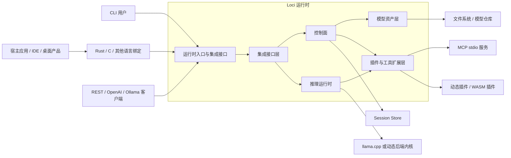
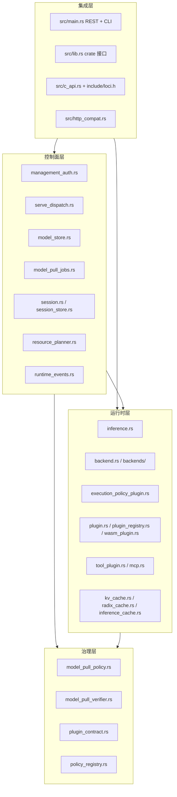
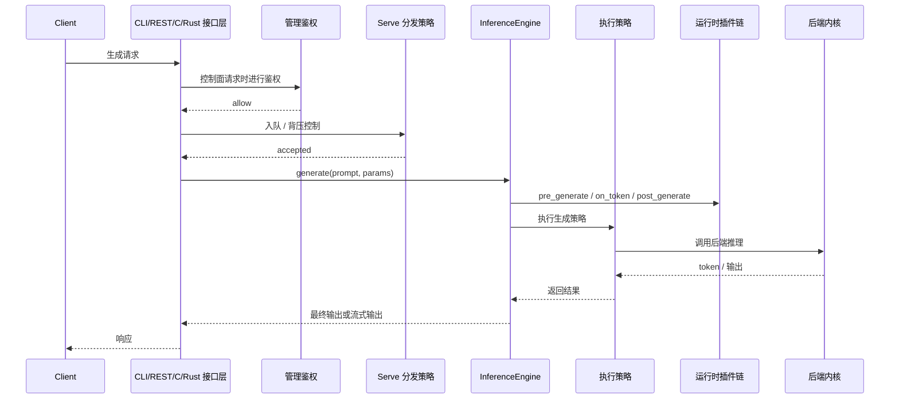
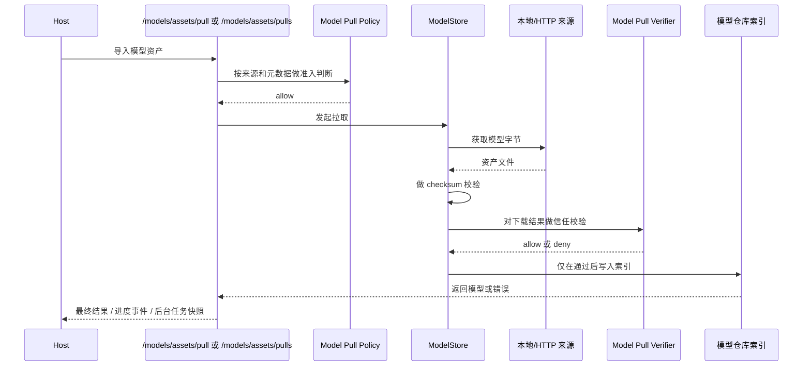
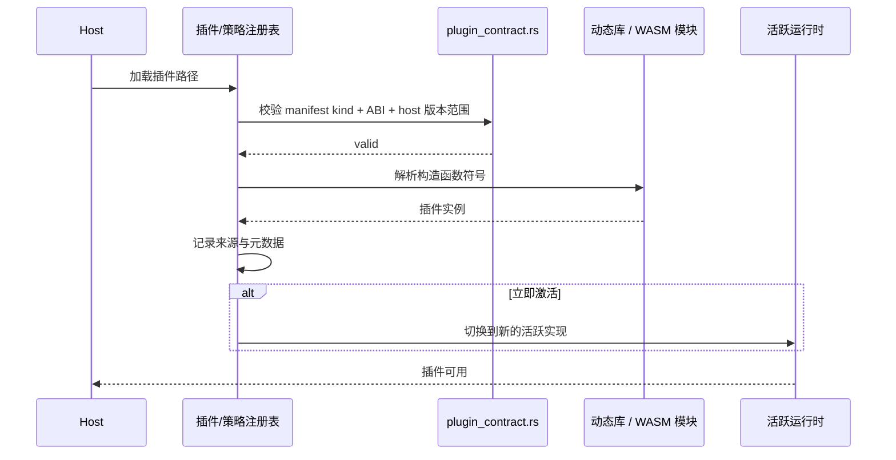

# Loci 架构设计

最后更新：2026-03-14

本文档用于从架构层说明当前仓库中的 Loci。

## 1. 产品定位

Loci 的定位是一个可嵌入的 AI 推理引擎与控制面。

它服务的对象不是最终用户聊天界面，而是桌面软件、IDE 助手、本地自动化系统、服务包装层和上层 Agent 宿主。它的职责是承接模型执行、插件升级、策略治理、模型资产管理、会话管理和宿主集成。

架构核心观点是：

- 推理运行时必须可嵌入。
- 运行时必须可插件升级。
- 治理权必须掌握在宿主手里。
- 兼容 API 只是适配层，不是系统核心。

## 2. 架构目标

- 多集成面：Rust crate、C ABI、REST。
- 多扩展面：文本插件、工具插件、策略插件、后端内核、图像内核。
- 本地优先执行：贴近用户硬件和本地存储。
- 宿主可控治理：鉴权、分发、执行策略、模型来源准入、模型信任校验。
- 运维可见性：运行时信息、指标、模型库存、会话控制。
- 支持上层编排：tools、MCP、session、策略注册表。

## 3. 非目标

- 在这个仓库内直接做成面向消费者的聊天 UI。
- 把引擎与某一个固定助手人格或固定 Agent 工作流绑死。
- 让 OpenAI/Ollama 兼容接口反客为主，变成系统核心模型。
- 把常规使用场景强行设计成云优先。

## 4. 系统上下文图

## 5. 分层视图

## 6. 核心组件职责

| 组件 | 职责 | 关键模块 |
|---|---|---|
| 集成接口层 | 通过 Rust、C、CLI、REST 向宿主暴露 Loci | `src/lib.rs`、`src/c_api.rs`、`src/main.rs` |
| 推理运行时 | 构建引擎、执行生成、流式输出、接入执行策略 | `src/inference.rs`、`src/backends/` |
| 插件运行时 | 装载静态、动态、WASM 插件进入生成链路 | `src/plugin.rs`、`src/plugin_registry.rs`、`src/wasm_plugin.rs` |
| 工具执行层 | 注册工具、装载 tool plugin、桥接 MCP | `src/tool_plugin.rs`、`src/mcp.rs`、`src/mcp_registry.rs` |
| 会话层 | 负责有状态交互的保存、恢复、销毁 | `src/session.rs`、`src/session_store.rs`、`src/session_bus.rs` |
| 模型资产层 | 注册外部模型、导入托管模型、追踪库存 | `src/model_store.rs`、`src/model_pull_jobs.rs` |
| 治理层 | 分发、鉴权、执行、模型来源和模型信任校验 | `src/serve_dispatch.rs`、`src/management_auth.rs`、`src/execution_policy_plugin.rs`、`src/model_pull_policy.rs`、`src/model_pull_verifier.rs` |
| 运行时事件主干 | 为宿主输出最近审计事件与实时事件流 | `src/runtime_events.rs`、`src/main.rs` |
| 兼容适配层 | 把 Loci 语义映射为 OpenAI/Ollama HTTP 合约 | `src/http_compat.rs`、`src/main.rs` |
| 资源规划层 | 估算设备放置、推断内存策略提示 | `src/resource_planner.rs`、`src/device.rs` |

## 7. 架构原则

### 7.1 控制面与数据面分离

Loci 把控制面和推理数据面明确分开：

- 控制面：鉴权、分发、模型库存、session 生命周期、策略激活、插件加载。
- 数据面：prompt 执行、token 流、embeddings、后端调用。

这样做的价值是：既能支持嵌入式调用，也能支持 service 模式部署，还能保证宿主侧治理路径清晰。

运行时事件总线进一步强化了这一分层，因为它在不绑定某一种日志后端的前提下，对控制面动作输出结构化事件。

### 7.2 兼容接口是适配层

OpenAI 和 Ollama 兼容接口是重要集成能力，但它们只是对同一个运行时的桥接。系统核心始终是 Loci 原生引擎、工具注册表、策略体系和模型治理链路。

### 7.3 治理链路分层

模型资产治理被有意拆成两层：

- 下载前治理：`model pull policy` 决定一个来源是否允许导入。
- 下载后治理：`model pull verifier` 决定一份已经下载完成并校验过的资产是否值得信任并持久化。

这样可以从简单 checksum 规则平滑演进到 sidecar、签名、证书、来源证明等机制，而不需要重写模型仓库。

### 7.4 插件不是 UI 附件，而是运行时扩展面

Loci 的插件并不只是对文本做简单前后处理，而是能扩展：

- 生成行为
- 工具执行
- 分发策略
- 管理鉴权
- 执行策略
- 模型来源策略
- 模型信任校验
- 后端内核加载
- 图像生成内核

## 8. 关键流程

### 8.1 生成请求流程

### 8.2 模型拉取治理流程

### 8.3 插件升级流程

## 9. 当前架构的优势

- 集成接口与运行时内部边界清晰。
- 扩展点丰富，而且没有强迫所有能力共用一种插件模型。
- 在多个关键操作点上有治理钩子。
- 模型生命周期已经从“直接读文件”演进到“库存管理 + 策略治理”。
- 兼容 API 没有复制第二套引擎。
- 能支撑 `localhand` 这类上层产品继续开发，而不把 Loci 本身写成某个具体助手的 UI 工程。

## 10. 还应该继续补哪些功能

如果要把 Loci 做成真正严肃的嵌入式推理底座，下面这些能力优先级最高。

### 10.1 稳定的 C ABI 插件 vtable

当前动态插件族依然主要依赖 Rust trait object 的 opaque 载荷。这能工作，但不是长期最强的 ABI 方案。

建议下一步：

- 为主要插件族定义 C 稳定的 vtable ABI
- 让当前 opaque ABI 作为过渡层保留

### 10.2 持久化事件 Sink 与嵌入式回调

Loci 现在已经具备统一的运行时事件主干，并通过 `/events` 与 `/events/stream` 对外暴露，但当前 sink 仍以进程内、内存态为主。

建议下一步：

- 增加可选的持久化 sink，例如滚动 NDJSON 文件、SQLite 或宿主自定义 appender
- 提供嵌入式回调注册能力，让桌面宿主无需经过 HTTP 也能订阅事件

### 10.3 Typed IPC / gRPC 控制面

REST 很好用，但桌面嵌入场景常常需要更低开销的类型化 IPC。

建议下一步：

- 增加 gRPC 或桌面友好的 IPC 层
- REST 继续作为通用对外适配层

### 10.4 进程外 Worker 协议

当前主要还是进程内运行。更强的隔离能力对大型宿主非常重要。

建议下一步：

- 引入 worker 协议，把模型执行放到进程外
- 保持宿主侧控制面稳定

### 10.5 显存 / 内存 / 磁盘的分层驻留

Loci 已经有资源规划和加载参数，但超大模型运行还需要真正的一等公民式分层策略。

建议下一步：

- 明确显存、内存、磁盘三层驻留模型
- 支持权重和 KV cache 的 paging / spill 策略
- 把它抽象成宿主可见的运行时策略，而不是零散后端参数

### 10.6 一等公民多模态主路径

多模态相关模块已经存在，但主 serve 路径仍然是 text-first。

建议下一步：

- 把多模态请求提升为主控制面能力
- 统一文本、图像、视觉、融合路径的宿主契约

### 10.7 更强的自动化治理

这对 `localhand` 这类项目尤其关键。

建议下一步：

- 增加明确的 OS action policy
- 增加浏览器、CLI、GUI 能力作用域
- 增加高风险操作的审批钩子和审计记录

### 10.8 生产级可观测性

当前有指标，但生产观测还不够强。

建议下一步：

- 结构化日志
- trace id
- endpoint / policy 维度的延迟拆解
- 插件故障计数

## 11. 仓库结构下一步建议

当前不建议在活跃开发期做大规模目录迁移。

中期可接受的目标结构：

- `src/runtime/` 承载推理、后端、缓存
- `src/control_plane/` 承载 REST、session、模型库存
- `src/governance/` 承载 auth、dispatch、execution、model pull policy、verifier
- `src/extensions/` 承载文本插件、tool plugin、MCP、图像/后端内核
- `docs/architecture/` 存放 ADR、图和路线

但在当前阶段，命名一致性比移动文件更重要。

## 12. 为什么这套架构站得住

Loci 能体现架构能力的地方主要在：

- 把产品定位和实现机制分开处理
- 明确划分运行时、控制面、扩展面
- 把兼容 API 当作适配层，而不是复制核心
- 用分层治理代替单个大而全策略口
- 在支持 service 部署的同时保留嵌入式能力
- 为上层助手产品留出空间，而不把引擎和某个助手 UX 绑死

## 13. 代码证据映射

- 运行时引擎：`src/inference.rs`
- 动态后端加载：`src/backends/dynamic.rs`
- REST/CLI 接口：`src/main.rs`
- Tool Plugin：`src/tool_plugin.rs`
- MCP 桥接：`src/mcp.rs`
- Session 生命周期：`src/session.rs`、`src/session_store.rs`
- 模型资产仓库：`src/model_store.rs`
- 后台模型拉取：`src/model_pull_jobs.rs`
- 模型来源策略：`src/model_pull_policy.rs`
- 模型信任校验：`src/model_pull_verifier.rs`
- 管理鉴权：`src/management_auth.rs`
- Serve 分发策略：`src/serve_dispatch.rs`
- 插件契约校验：`src/plugin_contract.rs`
- 运行时插件注册表：`src/plugin_registry.rs`
